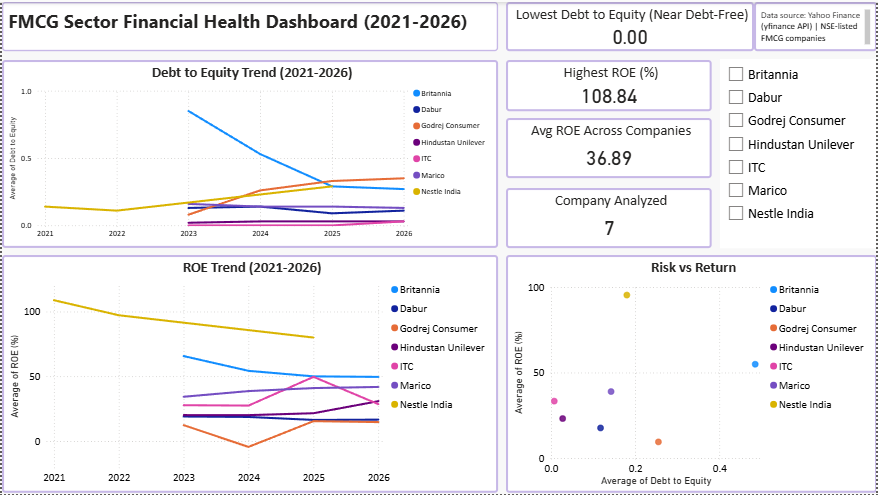

# FMCG Sector Financial Health Analysis (2021-2026)

A comparative financial analysis of 7 major NSE-listed FMCG companies, examining profitability, liquidity, and leverage trends over a 5-year period using Python and Power BI.

## Problem Statement

Investors and business analysts often need to quickly assess and compare the financial health of companies within a sector. This project analyzes how India's leading FMCG companies compare on profitability (ROE), liquidity (Current Ratio), and leverage (Debt-to-Equity), and identifies which companies exhibit the strongest and riskiest financial profiles.

## Companies Analyzed

- Hindustan Unilever (HINDUNILVR.NS)
- ITC (ITC.NS)
- Nestle India (NESTLEIND.NS)
- Britannia (BRITANNIA.NS)
- Dabur (DABUR.NS)
- Godrej Consumer (GODREJCP.NS)
- Marico (MARICO.NS)

## Data Source

Financial statement data (balance sheet and income statement) was collected using the [`yfinance`](https://pypi.org/project/yfinance/) Python library, which pulls data from Yahoo Finance for NSE-listed tickers.

## Methodology

1. **Data Collection** — Used `yfinance` to fetch balance sheet and income statement data for each company across all available fiscal years (2021-2026).
2. **Ratio Calculation** — Rather than relying on pre-built summary fields (which were often incomplete for Indian tickers), key ratios were calculated manually from raw financial statement line items:
   - **ROE (Return on Equity)** = Net Income / Total Shareholders' Equity × 100
   - **Current Ratio** = Current Assets / Current Liabilities
   - **Debt-to-Equity** = Total Debt / Total Shareholders' Equity
3. **Trend Analysis** — Ratios were computed for each available year per company to build a multi-year trend dataset.
4. **Visualization** — Trends and comparisons were visualized in both Python (matplotlib/seaborn) and an interactive Power BI dashboard.

## Key Findings

- **Nestle India** posted the highest ROE in the dataset (up to ~80-109%), but also had the lowest Current Ratio (0.80), suggesting a trade-off between profitability and short-term liquidity. Note: Nestle India's fiscal year changed during this period, so its data points are less frequent than other companies.
- **Godrej Consumer** recorded a net loss in FY2024 (ROE of -4.45%), followed by a recovery in FY2025-26 — a clear turnaround pattern.
- **ITC** showed a sharp ROE spike in FY2025 (49.62% vs. ~27-28% in other years), and has operated with virtually zero debt (Debt-to-Equity ~0.00-0.03) across the period, reflecting an extremely conservative capital structure.
- **Hindustan Unilever** and **ITC** are the most conservatively financed companies in the group (Debt-to-Equity consistently under 0.05), while **Godrej Consumer** carries the highest leverage (up to 0.35).
- **Britannia** has been steadily reducing its leverage over the period, with Debt-to-Equity falling from 0.85 (FY2023) to 0.27 (FY2026).
- Overall, the data reveals a **risk-return trade-off** across the sector: low-debt companies (HUL, ITC) show moderate, stable returns, while higher-return companies (Nestle) carry more liquidity risk.

## Dashboard

The Power BI dashboard includes:
- KPI cards for highest ROE, lowest Debt-to-Equity, average ROE, and companies analyzed
- ROE trend line chart (2021-2026)
- Debt-to-Equity trend line chart (2021-2026)
- Risk vs. Return scatter plot (Debt-to-Equity vs. ROE, per company-year)
- Company filter/slicer for interactive exploration



## Tools Used

- **Python** (yfinance, pandas, matplotlib, seaborn) — data collection, ratio calculation, and exploratory visualization
- **Power BI** — interactive dashboard for business-facing analysis
- **Jupyter Notebook** — documented, step-by-step analysis workflow

## Repository Contents

```
├── fmcg_financial_analysis.ipynb     # Main analysis notebook
├── fmcg_data/                         # Collected data and calculated ratios
│   ├── *_balance_sheet.csv
│   ├── *_income_statement.csv
│   ├── fmcg_calculated_ratios.csv
│   └── fmcg_multiyear_ratios.csv
├── fmcg_dashboard.pbix               # Power BI dashboard file
├── dashboard_screenshot.png          # Dashboard preview image
└── README.md
```

## Limitations

- Nestle India's data has fewer year-over-year points due to a fiscal year-end change during the analysis period.
- Ratios are based on `yfinance` data, which may occasionally differ slightly from figures reported directly by companies or platforms like screener.in.
